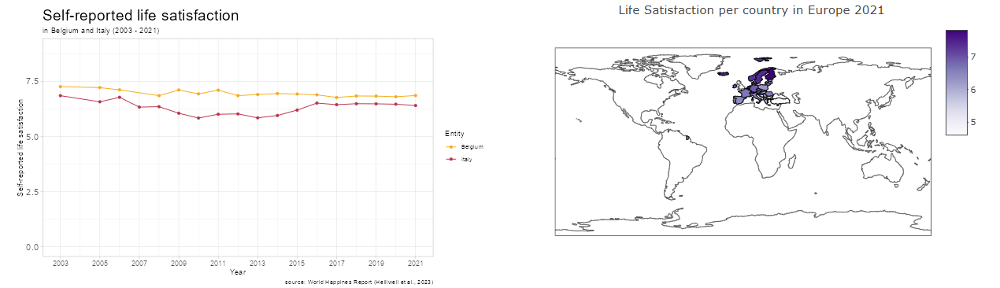
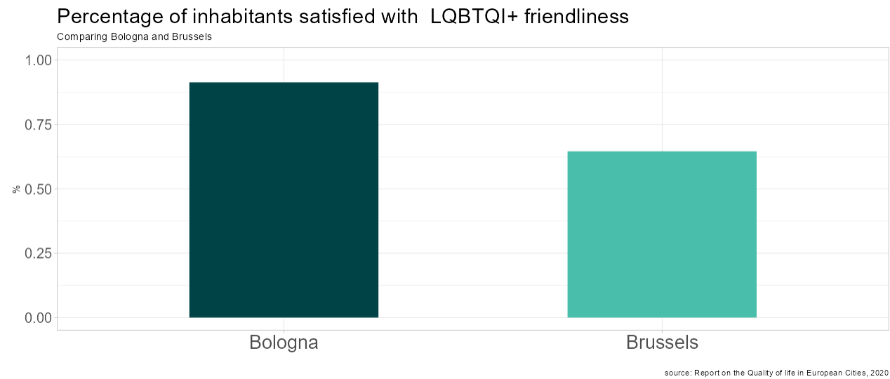

```{r, include = FALSE}
knitr::opts_chunk$set(
  collapse = TRUE,
  comment = "#>"
)
```

```{r setup}
library(EuroCity)
library(knitr)
```

## Overview: Functionality of the `EuroCity` package

**What do I use the `EuroCity` package for?**

`EuroCity` provides a user interface in form of a shiny app to compare selected European cities regarding: 

* country-wide self-reported life satisfaction
* inhabitants' satisfaction with several quality of life criteria
* Product prices & living expenses 

It also provides you the respective data sets, as well as functions to filter these data sets for certain city names, product prices, and quality of life criteria. 

The following vignette gives you an overview over how to use the `shall_I_move` shiny app (1), what the included data sets contain (2), and how to use filter functions (3). 

---

## 1: Shiny app user interface - `shall_I_move()`

You can start the shiny app for city comparison by running: 

```{r start_shiny, eval = FALSE}
shall_I_move()
```

This command opens the user interface. It consists of 2 tabs: 

1. `Life satisfaction`: Comparing country-wide life satisfaction and satisfaction with quality of life criteria for 2 chosen cities. 
2. `Living expenses`: Comparing prices of selected products for 2 chosen cities.


### Sidebar: Choosing countries and cities

Both tabs contain a side bar, allowing the user to choose 2 cities to compare. 

To facilitate search, users can first choose the country of interest. This causes a conditional drop-down menu to appear, showing those cities within the chosen country that are included in the data: 


*NOTE*: The app will return an error if: 

* You have not selected any countries or cities yet. In this case, the plots illustrating the comparisons do not appear. 
* You have chosen the same city twice. In this case, please select two non-identical cities for comparison
* Furthermore, there unfortunately is not data available on the self-reported life satisfaction in the UK. However, you can still see how well cities in the UK have been rated regarding quality of life criteria.

### Tab 1: Comparing Life Satisfaction of 2 European cities

Already after having chosen 2 countries, 2 plots will appear on the right-hand side: 
* A line graph showing the trajectory of self-reported life satisfaction in the two chosen countries from 2003 until 2021
* A map illustrating the country-means of life satisfaction in 2021 for all European countries included in the app




Next, select a criterion that you are interested in in the radio-button-menu below: 


You will then see a bar plot comparing citizens' ratings of the chosen criterion for the respective cities: 




### Tab 2: Comparing Living Expenses of 2 European cities

To compare living expenses, direct to the `Living Expenses` tab and choose two cities of interest in the side bar. 

Below, you will find a drop-down menu in which you can choose the product for which you would like to compare prices. Just like in the drop-down menu for country and city, first choose a product category. The following categories are available: 

* Housing
* Groceries
* Alcoholic Beverages
* Leisure Time and Going Out
* Transportation

After having chosen a category, a second drop-down menu will appear in which you can select a specific product within this category: 


In the main panel on the right, a bar plot will be shown which illustrates how much the chosen product cost on average in May 2023 in the chosen cities (prices in €):


---

## 2: Included data sets 

The following data sets are included in `EuroCity`: 

* `cities`: overview over the cities included in the package. This is mainly used for internal computations (but feel free to use it). 
* `price_categories`: overview over the products which are included in the living expenses comparison tab. This is also mainly used for internal function calls. 
* `city_prices`: contains the minimum, maximum, and average price of several goods in each European city (in May 2023).
* `life_satisfaction`: contains the mean self-reported life satisfaction of each European country between 2003 and 2021. 
* `qualityOL`: Contains the percentage of a city's inhabitants reporting to be either "rather satisfied" or "very satisfied" with a range of quality of life criteria in their city

Below you find a summary of the 3 main data sets in `EuroCity`: 

### The city_prices data set 

This data frame contains prices of various goods in European cities. Prices are reported in Euro and were retrieved in May 2023. Data was taken from Cost of Living & Prices API. Copyright therefore does not fall under the MIT license but belongs to Cost of Living & Prices API.

Call this data set by running `city_prices`

**Format:**

The data frame includes: 

* `country`: The country name 
* `city`: The city name (in English)
* `item_name`: The name of the product
* `category`: The Category which the product belongs to. Values are "Housing", "Groceries", "Alcoholic Beverages", "Leisure time and going out", "Transportation"
* `min`: lowest price of the product in the city (in €)
* `avg`: average price of the product in the city (in €). This value is presented in the shiny app comparison. 
* `max`: highest price of the product in the city (in €)

```{r city_prices_df}
head(city_prices)
```

### The life_satisfaction data set 

This data frame contains a subset of the data of the World Happiness Report 2023. Data were collected yearly from 2003 to 2021 and includes country-wide means of self-reported life satisfaction on a scale of 0 to 10.

Call this data set by running `life_satisfaction`

**Format:**

The data frame includes: 

* `Entity`: the Country name
* `Year`: Year of measurement
* `Life_satisfaction`: Country mean of self-reported life satisfaction on a scale of 0 to 10 
* `Code`: Country Code (used for plotting map in shiny)

```{r life_satisfaction_df}
head(life_satisfaction)
```
### The qualityOL data set

Contains the results of the Report on the Quality of life in European Cities, reported in 2019 and published in 2020.

Call this data set by running `qualityOL`

**Format:**

The data frame includes:

* `country`: Country name
* `city`: City name
* `variable`: Criterion participants were asked to rate. Values are: 
  * "LGBTQI" = LGBTQI+ friendliness
  * "air" = Air quality
  * "clean" = Cleanness 
  * "culture" = Diverse cultural offer
  * "edu" = Quality of education 
  * "greenery" = Presence of green spaces
  * "health" = Quality of health system
  * "noise" = Low noise level
  * "racial" = Quality of life for ethnic minorities
  * "safety" = Perceived safety
  * "sport" = Presence of sport facilities
  * "transp" = Public transport 
  * "satisfaction" = general life satisfaction
* `percentage`: percentage of participants reporting to be 'rather satisfied' or 'very satisfied' with the respective criterion in their city

--- 

## 3: Filter functions

The package also includes functions which you can use to filter the data sets presented above to get the data you are interested in. 

There are two options: 

* Filter the `city_prices` data set for 2 cities. This can be done using the `filter_prices()` function. 
* Filter the `qualityOL` data set for 2 cities and a criterion of your interest. For this, use the `filter_QoL_comparison` function. 

### Filter_prices()

If you want to do your own analyses apart from the shiny App and wish to compare living expenses between 2 cities, you can use the `filter_prices()` function.

### Function arguments 

It takes as arguments 2 city names: 

`filter_prices(city1, city2)`

You can find valid values for `city1` and `city2` either in the documentation (run `?filter_prices`) or by running: 

```{r filter_prices_inputs}
unique(city_prices$city)
```
### Demonstration

For instance, if you would like to get data on the living expenses in Berlin and Amsterdam, run the following code:

```{r filter_prices}
BerAms_prices <- filter_prices("Berlin", "Amsterdam")
```

This function returns a data frame in the same format as `city_prices`(see above):

```{r head filter_prices}
head(BerAms_prices)
```

But it now only contains data on Amsterdam and Berlin: 

```{r demo_filter1}
unique(BerAms_prices$city)
```

## Filter quality of life rating

Likewise, you can also filter the `qualityOL` data set for 2 cities and a criterion you are interested in. 

### Function arguments

The function takes two city names as arguments, as well as the criterion you would like to compare the cities on: 

`filter_QoL_comparison(city1, city2, criterion)`

To find out which cities and criteria you can filter by, check the documentation (`?filter_QoL_comparison`). 

### Demonstration

Say you want to compare citizen's satisfaction with the public transport system in Amsterdam and Berlin, run the following code:

```{r demo_filter2}
BerAms_transport <- filter_QoL_comparison("Berlin", "Amsterdam", "transp")
```

This returns a data set in the same format as `qualityOL` but now only containing 2 rows: 

```{r demo_filter3}
BerAms_transport
```


